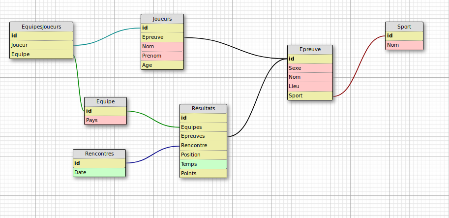

# Projet-BDD
Repo du projet de base de donnée de L2 Paris-Diderot

---
## À faire

- Mettre en place le SQL dans la base de donnée
- Écrire le CSV pour les données dans la BDD
- Importer les données dans la BDD
- Se répartir les requêtes
	- 50% chacun
-

## Structure des données

---

## Notes

- https://en.wikibooks.org/wiki/Converting_MySQL_to_PostgreSQL
- https://raw.githubusercontent.com/hadley/data-baby-names/master/baby-names.csv
