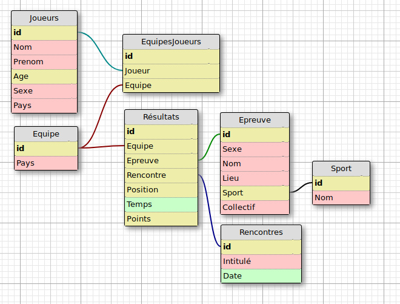

# BD3, Nid d'espions
---
> Rapport sur le projet de base de données du cours de BD3

_David Bauer_ david.bauer@etu.univ-paris-diderot.fr
_Nelson Perdriau_ nelson.perdriau@etu.univ-paris-diderot.fr


## Préface

Le projet de base de donnée nous as avant tout parut extrêment complexe. La mise en place du projet ainsi que la réflexion sur la conception à ainsi commencé peu de temps après l'annonce du sujet. Même si il aurait été préférable d'avoir le sujet dès le début de l'année, nous avons pris les devant.

Pour nous permettre de travailler de façon collaborative, nous avons créer un projet sur GitHub, que nous avons volontairement laissé en accès libre. Ce choix peut paraître étrange, car il parait rendre extrêment facile le plagiat, mais il permet surtout d'aider nos camarades ayant des difficultés, tout en leur laissant la possibilité de se faire punir pour plagiat si l'envie leur en prennait. En effet, tout nos commits sont en ligne, et bonne chance pour faire des faux commits.

La conception de la structure de la base de donnée nous a demandé une journée, à l'issue de laquelle nous avons créer le schéma E/R qui sera présenté dans la suite du rapport.

Ensuite, la partie la plus longue aura été d'entrer les données dans la base. Cette partie nous as confut, car à part nous faire mal aux doigts nous n'avons rien appris de particulier. Nous avons passé de très longues heures à écumer Wikipédia et à inventer des noms de joueurs, temps que nous aurions pu passer à affiner la structure de nos tables ou proposer des solutions plus élégantes.

Par rapport aux données sur lesquels nous avons travaillé, nous avions tout d'abord pensé importer des fichiers CSV trouvé sur le web contenant toutes les informations sur les jeux olympiques de Rio. Mais le temps qu'il nous aurait fallut pour adapter la structure des dits fichiers à notre base de donnée aurait été plus long que d'inventer une bonne parties des joueurs, des temps, des rencontres. Nous avons conservé la structure du déroulement des jeux olympiques et des sports, que nous avons eu en grande partie sur Wikipédia. Nous en avons d'ailleur profité pour contribuer aux pages consultées et ajouter des informations aux articles de l'encyclopédie libre.

Nous n'avons évidemment pas oublié les quelques données nécessaires pour les réponses aux questions qui demandaient des informations précises, comme celle sur Michael Phelps.

Les réponses aux questions sont dans le fichier `requetes.sql`, qui est lui-même appelé par `run.sql` qui se charge de "nettoyer" la base de donnée, importer les données, et enfin éxecuter les requêtes.

## Sommaire

* Structure de la base de donnée
	* Schéma
	* Commentaire sur la conception
* Réponses aux questions
	* Questions obligatoires
	* Questions facultatives
	* Questions réalisées à notre initiatives
	* Questions sur l'organisation et la prévision
* Commentaire sur les questions et les réponses apportées
* Conclusion


## Structure de la base de donnée

### Schéma SQL

Pour modéliser ce schéma, nous avons eu recourt à un outil en ligne qui nous permet de creer de façon visuelle la structure de la base de donnée. Une fois que le schéma nous semblait correspondre à ce qui nous était demandé, nous avons écrit à la main les requêtes SQL permettant de créer les tables dans le serveur pSQL.




* Lexique
	* *Jaune* : INT
	* *Rouge* : TEXT
	* *Vert* : TEMPS

### Commentaire sur le conception

Lorem ipsum dolor sit amet, consectetur adipisicing elit, sed do eiusmod tempor incididunt ut labore et dolore magna aliqua. Ut enim ad minim veniam, quis nostrud exercitation ullamco laboris nisi ut aliquip ex ea commodo consequat. Duis aute irure dolor in reprehenderit in voluptate velit esse cillum dolore eu fugiat nulla pariatur. Excepteur sint occaecat cupidatat non proident, sunt in culpa qui officia deserunt mollit anim id est laborum.

## Réponses aux questions

### Questions obligatoires

Nous reproduisons ici les réponses aux questions sous la forme de code SQL, avec nos commentaires en dessous de chacune des requêtes.

* La liste des athlètes italiens ayant obtenu une médaille
	```
	SELECT Joueur FROM EquipesJoueurs WHERE
		JOIN EquipesJoueurs, Resultats
		ON EquipesJoueurs.id = Resultats.Equipes
		AND EquipesJoueurs.Equipe.Pays = 'ITA'
		AND Resultats.position = 1
			OR Resultats.position = 2
			OR Resultats.position = 3;
	```

	Cette première requête n'a pas posé de grandes difficultés, mais nous a permis de mettre notre base de donnée à l'épreuve du feu, et de valider en partie notre modèle.

<!-- Finir les questions -->

### Questions facultatives

Nous avons souhaité donnée une piste de réponse par rapport aux questions que nous avons choisit de ne pas traiter. Il ne s'agit pas de requêtes à proprement parler mais plus d'une réponse que l'on pourrait donner à l'oral.


### Questions réalisé à notre initiative

Pour la question 3, nous avions 3 requêtes à inventer.

* Les joueurs venant de République Démocratique Populaire de Corée n'ayant pas fait le pire temps de leur épreuve de Natation.

* Les pays ayant la parité homme/femme dans leurs équipes.

* Les épreuves ayant eu lieu au même endroit et à la même date mais n'étant que des sport collectifs féminins.

### Questions sur l'organisation et la prévision

Lorem ipsum dolor sit amet, consectetur adipisicing elit, sed do eiusmod tempor incididunt ut labore et dolore magna aliqua. Ut enim ad minim veniam, quis nostrud exercitation ullamco laboris nisi ut aliquip ex ea commodo consequat. Duis aute irure dolor in reprehenderit in voluptate velit esse cillum dolore eu fugiat nulla pariatur. Excepteur sint occaecat cupidatat non proident, sunt in culpa qui officia deserunt mollit anim id est laborum.


## Commentaire sur les questions et les réponses apportées

Lorem ipsum dolor sit amet, consectetur adipisicing elit, sed do eiusmod tempor incididunt ut labore et dolore magna aliqua. Ut enim ad minim veniam, quis nostrud exercitation ullamco laboris nisi ut aliquip ex ea commodo consequat. Duis aute irure dolor in reprehenderit in voluptate velit esse cillum dolore eu fugiat nulla pariatur. Excepteur sint occaecat cupidatat non proident, sunt in culpa qui officia deserunt mollit anim id est laborum.


## Conclusion

Lorem ipsum dolor sit amet, consectetur adipisicing elit, sed do eiusmod tempor incididunt ut labore et dolore magna aliqua. Ut enim ad minim veniam, quis nostrud exercitation ullamco laboris nisi ut aliquip ex ea commodo consequat. Duis aute irure dolor in reprehenderit in voluptate velit esse cillum dolore eu fugiat nulla pariatur. Excepteur sint occaecat cupidatat non proident, sunt in culpa qui officia deserunt mollit anim id est laborum.
